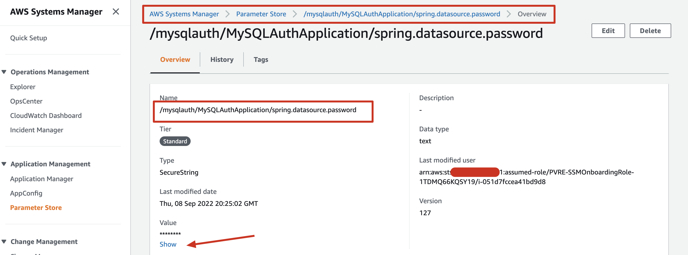
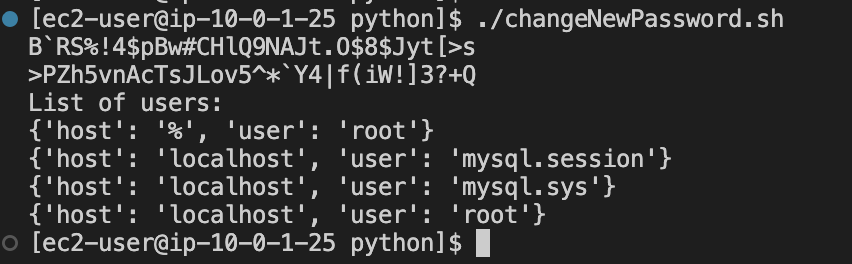
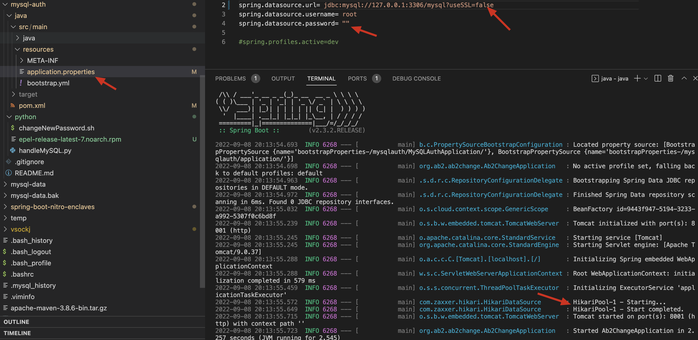
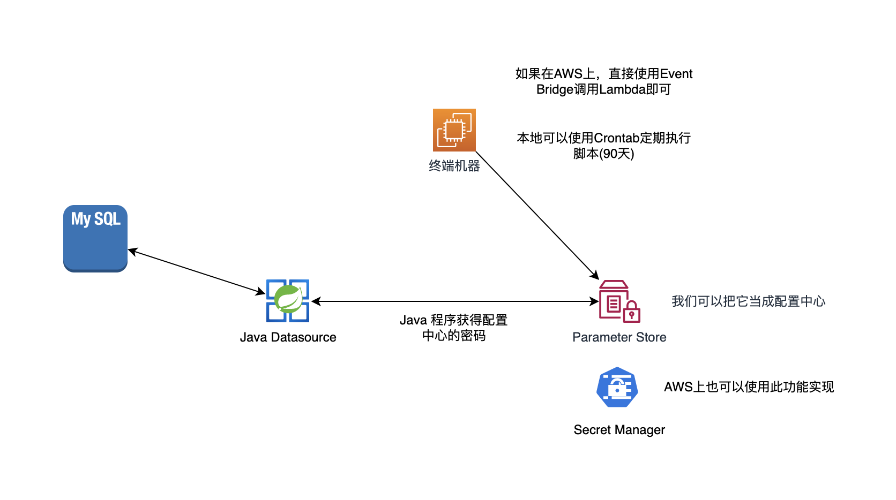

# mysql-auth

# 克隆本项目

```
git clone https://github.com/sunchaoqun/mysql-auth
```

# 启动一个测试的数据库 (本文以AWS EC2为例)
```
docker run --name local-mysql -p3306:3306 -e MYSQL_ROOT_PASSWORD='sun1234' -v $HOME/mysql-data:/var/lib/mysql -d mysql:5.7
```

# 安装一个Mysql Client

```
sudo yum install -y https://repo.percona.com/yum/percona-release-latest.noarch.rpm
sudo yum install -y mysql-client

```

# 登录数据测试连通性

```
mysql -h 127.0.0.1 -uroot -p 
```

# 在AWS创建一个存储，方便Spring Boot读取



# 根据您的项目名称修改 数据库与Spring对接的参数名

python -> handleMySQL.py 第9行

"/mysqlauth/MySQLAuthApplication/spring.datasource.password"

# 程序会使用AWS的API生成随机密码，如果非AWS环境可以自行实现随机密码

python -> handleMySQL.py 第74行

# 创建一个定时任务每个5分钟执行一次，可以根据密码过期要求设置成30天或者90天，以下为模拟执行，此处只为存储数据库密码的位置，可以根据自己的情况修改实现

```
crontab -e
```

*/5 * * * * /home/ec2-user/mysql-auth/python/changeNewPassword.sh

结果的第一条为原始的密码，第二条为最新的密码，并且存入到配置中心(此处使用的是AWS的Parameter Store)



# 为了验证本项目中也提供了Spring boot的Java程序，通过读取配置中心文件，保证修改密码后程序不会受到影响，使用的是Spring Boot的bootstrap特性

```
cd java

mvn spring-boot:run
```



# 整体的架构图如下




